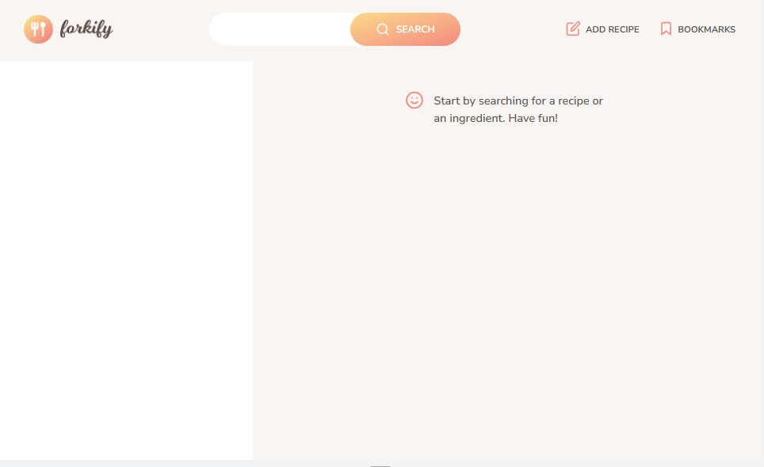

# Forkify app

Forkify is a potent recipe search and saving application that has been expertly constructed using HTML5, CSS3, and JavaScript, with an emphasis on the Model-View-Controller (MVC) architecture. The app leverages the Forkify API to provide users with a comprehensive database of recipes, which can be searched, filtered, and saved with ease.

The intuitive and streamlined interface, complete with dynamic serving size adjustment functionality, allows users to access Forkify's vast recipe library quickly and easily. Advanced JavaScript concepts such as asynchronous programming, ES6 modules, and object-oriented programming are employed to deliver a smooth and responsive user experience.

The use of the MVC architecture and Forkify API showcases the app's versatility and highlights its potential for further development.

# Key features

- Search for recipes: The application allows users to easily search for recipes by entering keywords or ingredients in the search bar.
- Recipe details: Users can view detailed information on ingredients, cooking instructions, and serving sizes for each recipe.
- Bookmark recipes: The app enables users to save their favorite recipes for quick access later on.
- Add recipes: Users can create and share their own recipes with others through the application.
- Pagination: The application offers easy navigation through search results using pagination.
- Responsive design: The app has a responsive design that ensures optimal user experience across different devices.

# Project image

